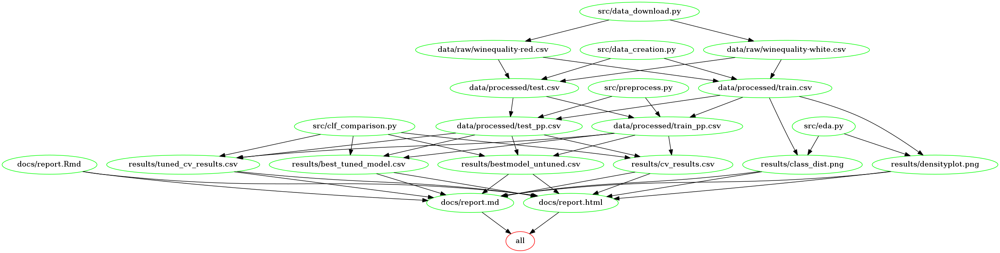

# Wine Quality Prediction (DSCI522_group17)
Group work for DSCI522 Our group  number is 17

Date: 11/27/2020

Team members: Pan Fan, Chun Chieh Chang and Sakshi Jain

GitHub repository: https://github.com/UBC-MDS/DSCI522_group17

## Summary
In this project we built several models to try to predict wine quality given different physicochemical properties and wine type. We built a K-Nearest Neighbor model, Logistic Regression model, Random Forest Model, and Support Vector Machine model. Since there exists an issue of class imbalance in the data set, we will be using f1-score as our validation metric. After we built these models, we found out that Random Forest is the best performing model and it achieved a test score of 0.63. However, despite it being a good score, there is still room for improvement. From our cross validation results, we can see that we are overfitting with Random Forest even after hyperparameter tuning. A solution for this problem will be to increase the number of data when training the model, which is not possible because we have no ways to collect additional data. Another solution for this problem will be to use a more powerful computer to search for more hyperparameter combinations. At the current state we can conclude that our model is usable because it performs better than our baseline model by a large margin and also the accuracy of prediction is over 60%.

The data set used in this project is sourced from the UCI Machine Learning Repository and can be found [here](https://archive.ics.uci.edu/ml/datasets/Wine+Quality). In terms of the data, the two data sets record the physicochemical properties of the red and white variants of the Vinho Verde wine. We merged these two datasets together and created a new column `type of wine` to represent the wine type for each observation. The `quality_level` is the target we are interested in predicting and it represents the quality of the wine on a scale of 1 to 10. We will group the quality of wine into three categories and they are "Excellent" if `quality_level` is equal to or greater than 7, "Good" if `quality_level` is between 4 and 7(exclusive), and "Bad" if `quality_level` is less than or equal to 4. We also have a categorical variable `wine_type` that we will include as a feature. In total, we have 12 predictors and one output variable.

## Report

A copy of the report can be found [here](https://github.com/UBC-MDS/DSCI522_group17/blob/main/docs/report.md)

## Usage
### 1. Using Docker with Mac

To replicate the analysis, clone this GitHub repository and run the following commands at the command line/terminal from the root directory of this project:

    docker run --rm -v /$(pwd):/home/project jason2762/wine_analysis:latest make -C /home/project all

To delete the results, please run the following commands at the command line/terminal from the root directory of this project:

    docker run --rm -v /$(pwd):/home/project jason2762/wine_analysis:latest make -C /home/project clean

### 2. Using Docker with Windows

To replicate the analysis, clone this GitHub repository and run the following commands using power shell from the root directory of this project:

    docker run --rm -it -v <Project_Path>:/home/project jason2762/wine_analysis:latest make -C /home/project all

To delete the results, please run the following commands using power shell from the root directory of this project:

    docker run --rm -it -v <Project_Path>:/home/project jason2762/wine_analysis:latest make -C /home/project clean
### 3. Without using Docker

To replicate the analysis, clone this GitHub repository, install the dependencies listed below, and run the following commands at the command line/terminal from the root directory of this project:

    make all

To delete the results, please run the following commands at the command line/terminal from the root directory of this project:

    make clean

The Makefile graph is as follows:
    

## Dependencies

Python 3.8.3 and Python packages:

* docopt==0.6.2
* requests==2.23.0
* pandas==1.0.5
* seaborn==0.11.0
* pandocfilters==1.4.2
* scikit-learn== 0.23.2

R  4.0.2 and packages:
* tidyverse==1.3.0
* knitr==1.29

## License

Please refer to the License File [here](https://github.com/UBC-MDS/DSCI522_group17/blob/main/LICENSE)

## References

P. Cortez, A. Cerdeira, F. Almeida, T. Matos and J. Reis.
Modeling wine preferences by data mining from physicochemical properties. In Decision Support Systems, Elsevier, 47(4):547-553, 2009.

