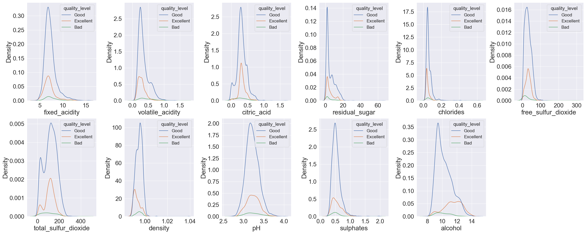

```{r setup, include=FALSE}
knitr::opts_chunk$set(echo = FALSE)
library(knitr)
library(tidyverse)
```

```{r echo = FALSE, include=FALSE}
cv_results <- read_csv('../results/cv_results.csv')
cv_results <- cv_results %>% rename(Models = X1)
cv_results <- cv_results %>% select(-c(fit_time,score_time)) %>% rename(validation_score = test_score)
best_model <- cv_results %>% arrange(-validation_score) %>% slice(1) %>% pull(Models)
best_model_result <- read_csv('../results/bestModel.csv')
test_score <- best_model_result %>% select(Test_Score) %>% pull()
```

# Summary

In this project we built several models to try to predict wine quality given different physicochemical properties and wine type. We built a K-Nearest Neighbor model, Logistic Regression model, Random Forest Model, and Support Vector Machine model. After we built these models, we found out that `r best_model` is the best performing model and it achieved a test score of `r round(test_score, 2)`. However, despite it being a good score, there is still room for improvement. From our cross validation results, we can see that we are overfitting with `r best_model`. This is because we have not tune our hyperparameters. Hence, further investigation and tuning are needed before we can finalize our model. 

# Introduction

Wine is a fermented fruit juice which contains alcohol as its main ingredient. It’s complex chemical process which starts with the selection of the fruit, its fermentation into alcohol, and the bottling of the finished liquid. In this entire process, chemicals produced by yeasts after consuming sugar of the fruit, play very important role in producing different style of wine and even the quality depends on it.

Across the world, wine plays an important part of culture. It is both liked and disliked. In some continents like Europe and America, there is no celebration, no cheers up without wine whereas wine is disliked and even legally banned in some parts of Asia. Wine’s popularity has increased by development of innovative flavors and advanced distribution systems. According to Statista, the global wine market was valued at 354.7 billion in U.S dollars in 2018 and is estimated to grow 21 percent by 2023 ultimately valuing over 429 billion U.S dollars[@statista]. Hence, it’s important to know the quality of wine to determine its price as well to target premium wine customers.

# Methods

## Data

The data set used in this project is sourced from the UCI Machine Learning Repository[@Dua:2019] and can be found [here](https://archive.ics.uci.edu/ml/datasets/Wine+Quality). In terms of the data, the two data sets record the physicochemical properties of the red and white variants of the Vinho Verde wine. We merged these two datasets together and created a new column `type of wine` to represent the wine type for each observation. The `quality_level` is the target we are interested in predicting and it represents the quality of the wine on a scale of 1 to 10. We will group the quality of wine into three categories and they are "Excellent" if `quality_level` is equal to or greater than 7, "Good" if `quality_level` is between 4 and 7(exclusive), and "Bad" if `quality_level` is less than or equal to 4. We also have a categorical variable `wine_type` that we will include as a feature. In total, we have 12 predictors and one output variable.

## Analysis

For this project, we will be using models such as Logistic Regression, Randomized Forest, Support Vector Machine, and K-Nearest Neighbor to help us predict wine quality.

To build our models, we will be using Python[@Python] and it's associated libraries. We will be using docopt[@docopt]and os[@Python] to help us automate our script, Pandas[@pandas] to structure our data, Seaborn[@seaborn] and PandasProfiling[@pandaprofile] to plot the figures, and sklearn[@sklearn] to build our models. In terms of presenting our results, we will use R [@R], tidyverse package[@tidyverse], and the knitr package[@knitr] to present our results. If you are interested in the codes that were used to build our model, they can be found at https://github.com/UBC-MDS/DSCI522_group17/blob/main/src/


# Results

We will first begin by examining the distribution of each numeric feature given the class we are trying to predict. Figure 1 plots the density of each numeric feature given wine quality. From examining each density plot, we observed that there are a lot of overlaps between the density of each class. However, The feature `Density` and `Alcohol` seem to have different mean and spread given wine quality. This is a great sign as these two features could be good features that allow our machine learning model to distinguish different classes effectively. Also, We can see that most features are right skewed.  

```{r fig.cap = "Fig 1. Density Plot of Numeric Features Given Wine Quality", out.width = '120%', out.height = '120%'}

```

We used cross validation with the default cv of 5 to fit our models and obtained the mean statistics of each model. The scoring metric we decided to use is accuracy. The summary table is shown in Table 1 below. From observing the table, we used the model with the highest test score as our main model. In this case, the best model was `r best_model` so we refitted `r best_model` on our training set and evaluated the model on the test set. 

```{r}
knitr::kable(cv_results, caption = 'Table 1. 5 Fold Cross Validation Results')
```

Our model achieves an accuracy of `r round(test_score,2)` in predicting the correct wine quality given physicochemical and wine types, which in our opinion is a relatively good score. However, there is still room for improvement. From our cross validation results, we can see that we are overfitting with `r best_model`. This is because we have not tune our hyperparameters. Hence, further investigation and tuning are needed before we can finalize our model. 

# Discussion

At first glance, one can argue that `r round(test_score,2)` is a good score. However, due to overfitting, we can still improve our model through hyperparameter tuning. Hence, our next step in this project would be to tune our hyperparameter either through grid search or randomized search.

# Future steps: 

We have three classes: "Bad", "Good" and "Excellent" under "Quality level" variable. In the analysis, we need to address the issue of class imbalance as the majority of data is coming under "Good" wine. This can impact the selection of metric and choice model technique in feature.

# References