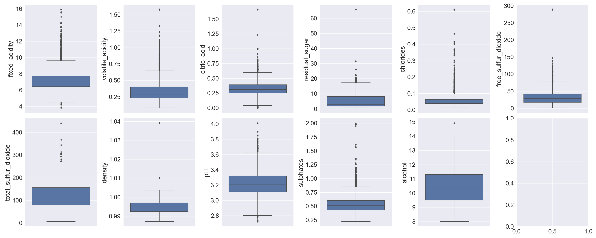

Predicting Wine Quality Given Physicochemical and Wine Type
================
Chun Chieh Chang, Sakshi Jain, Pan Fan
2020/11/27 (Updated: 2020-11-29)

# Summary

In this project we built several models to try to predict wine quality
given different physicochemical properties and wine type. We built a
K-Nearest Neighbor model, Logistic Regression model, Random Forest
Model, and Support Vector Machine model. After we built these models, we
found out that Random\_Forest is the best performing model and it
achieved a test score of 0.98. However, despite it being a good score,
it could be very misleading due to us predicting less classes compared
to the original data as well as the existence of imbalance classes.
Hence, further analysis is needed before we could conclude on which
model to pick as our finalized model.

# Introduction

Wine is a fermented fruit juice which contains alcohol as its main
ingredient. It’s complex chemical process which starts with the
selection of the fruit, its fermentation into alcohol, and the bottling
of the finished liquid. In this entire process, chemicals produced by
yeasts after consuming sugar of the fruit, play very important role in
producing different style of wine and even the quality depends on it.

Across the world, wine plays an important part of culture. It is both
liked and disliked. In some continents like Europe and America, there is
no celebration, no cheers up without wine whereas wine is disliked and
even legally banned in some parts of Asia. Wine’s popularity has
increased by development of innovative flavors and advanced distribution
systems. According to Statista, the global wine market was valued at
354.7 billion in U.S dollars in 2018 and is estimated to grow 21 percent
by 2023 ultimately valuing over 429 billion U.S dollars(Oloruntoba
2020). Hence, it’s important to know the quality of wine to determine
its price as well to target premium wine customers.

# Methods

## Data

The data set used in this project is sourced from the UCI Machine
Learning Repository(Dua and Graff 2017) and can be found
[here](https://archive.ics.uci.edu/ml/datasets/Wine+Quality). In terms
of the data, the two data sets record the physicochemical properties of
the red and white variants of the Vinho Verde wine. We merged these two
datasets together and created a new column `type of wine` to represent
the wine type for each observation. The `quality_level` is the target we
are interested in predicting and it represents the quality of the wine
on a scale of 1 to 10. We will group the quality of wine into three
categories and they are “Excellent” if `quality_level` is equal to or
greater than 7, “Good” if `quality_level` is between 4 and 7(exclusive),
and “Bad” if `quality_level` is less than or equal to 4. We also have a
categorical variable `wine_type` that we will include as a feature. In
total, we have 12 predictors and one output variable.

## Analysis

For this project, we will be using models such as Logistic Regression,
Randomized Forest, Support Vector Machine, and K-Nearest Neighbor to
help us predict wine quality.

To build our models, we will be using Python(Van Rossum and Drake 2009)
and it’s associated libraries. We will be using docopt(Keleshev 2014)and
os(Van Rossum and Drake 2009) to help us automate our script,
Pandas(team 2020) to structure our data, Seaborn(Waskom and team 2020)
and PandasProfiling(Brugman 2020) to plot the figures, and
sklearn(Pedregosa et al. 2011) to build our models. In terms of
presenting our results, we will use R (R Core Team 2020), tidyverse
package(Wickham et al. 2019), and the knitr package(Xie 2014) to present
our results. If you are interested in the codes that were used to build
our model, they can be found at
<https://github.com/UBC-MDS/DSCI522_group17/blob/main/src/>

# Results

We will first begin by examining the box plots of each numeric features.
Figure 1 presents the box plots of each numeric feature in the data set.
We can see that most features are right skewed with a lot of outliers
represented by the black points. The features density and alcohol,
however, only have two outliers respectively.

Fig 1. Boxplot of Numeric Variables

Next, we will examine the distribution of each numeric feature given the
class we are trying to predict. Figure 2 plots the density of each
numeric feature given wine quality. From examining each density plot, we
observed that there are a lot of overlaps between the density of each
class. However, The feature `Density` and `Alcohol` seem to have
different mean and spread given wine quality. This is a great sign as
these two features could be good features that allow our machine
learning model to distinguish different classes effectively.

Fig 2. Density Plot of Numeric Features Given Wine Quality

We used cross validation with the default cv of 5 to fit our models and
obtained the mean statistics of each model. The scoring metric we
decided to use is accuracy. The summary table is shown in Table 1 below.
From observing the table, we used the model with the highest test score
as our main model. In this case, the best model was Random\_Forest so we
refitted Random\_Forest on our training set and evaluated the model on
the test set.

| Models                | fit\_time | score\_time | test\_score | train\_score |
|:----------------------|----------:|------------:|------------:|-------------:|
| Logistic\_Regression  | 0.0326355 |   0.0018568 |   0.8382089 |    0.8396587 |
| Random\_Forest        | 0.2866400 |   0.0157819 |   0.9532951 |    1.0000000 |
| DummyClassifier       | 0.0012620 |   0.0006356 |   0.6897451 |    0.6901580 |
| SVC                   | 0.0757129 |   0.0105726 |   0.8515484 |    0.8657224 |
| K\_Nearest\_Neighbors | 0.0040413 |   0.0278746 |   0.8619789 |    0.9059640 |

Table 1. 5 Fold Cross Validation Results

Looking at Table 2, our model achieves an accuracy of 0.98 in predicting
the correct wine quality given physicochemical and wine types, which is
an unreasonably high score. This may be because we only have 3 different
classes to predict and hence the model is able to find a pattern to fit
the data perfectly. In addition, there is class imbalance issue such
that the number of observations of ‘Bad’ quality wine and ‘Excellent’
wine are significantly less than ‘Good’ quality wine. Hence, further
investigation is needed before we can finalize our model.

| Model          | Test\_Score |
|:---------------|------------:|
| Random\_Forest |       0.975 |

Table 2. Best Model and its Score on Test Set

# Discussion

At first glance, one can argue that 0.98 is a good score. However, this
score seems a little unreasonable due to several reasons. As mentioned
in the Result section, the original data has 10 different classes and
here we are only predicting 3 classes. Hence, there is a possibility
that the model found a pattern to predict the classes perfectly. In
addition, we have a class imbalance issue in which the number of
observations of ‘Bad’ quality wine and ‘Excellent’ wine are
significantly less than ‘Good’ quality wine. Hence, we need to
investigate further before we can make our conclusion.

# References

Brugman, Simon. 2020. *Docopt: Command-Line Interface Description
Language*. <https://github.com/pandas-profiling/pandas-profiling>.

Dua, Dheeru, and Casey Graff. 2017. “UCI Machine Learning Repository.”
University of California, Irvine, School of Information; Computer
Sciences. <http://archive.ics.uci.edu/ml>.

Keleshev, Vladimir. 2014. *Docopt: Command-Line Interface Description
Language*. <https://github.com/docopt/docopt>.

Oloruntoba, A. 2020. “Revenue of the Wine Market Worldwide by Country
2018.” *Statista*.
<https://www.statista.com/forecasts/758149/revenue-of-the-wine-market-worldwide-by-country>.

Pedregosa, F., G. Varoquaux, A. Gramfort, V. Michel, B. Thirion, O.
Grisel, M. Blondel, et al. 2011. “Scikit-Learn: Machine Learning in
Python.” *Journal of Machine Learning Research* 12: 2825–30.

R Core Team. 2020. *R: A Language and Environment for Statistical
Computing*. Vienna, Austria: R Foundation for Statistical Computing.
<https://www.R-project.org/>.

team, The pandas development. 2020. *Pandas-Dev/Pandas: Pandas* (version
1.0.5). Zenodo. <https://doi.org/10.5281/zenodo.3509134>.

Van Rossum, Guido, and Fred L. Drake. 2009. *Python 3 Reference Manual*.
Scotts Valley, CA: CreateSpace.

Waskom, Michael, and the seaborn development team. 2020.
*Mwaskom/Seaborn* (version 0.11.0). Zenodo.
<https://doi.org/10.5281/zenodo.592845>.

Wickham, Hadley, Mara Averick, Jennifer Bryan, Winston Chang, Lucy
D’Agostino McGowan, Romain François, Garrett Grolemund, et al. 2019.
“Welcome to the tidyverse.” *Journal of Open
Source Software* 4 (43): 1686. <https://doi.org/10.21105/joss.01686>.

Xie, Yihui. 2014. “Knitr: A Comprehensive Tool for Reproducible Research
in R.” In *Implementing Reproducible Computational Research*, edited by
Victoria Stodden, Friedrich Leisch, and Roger D. Peng. Chapman;
Hall/CRC. <http://www.crcpress.com/product/isbn/9781466561595>.

